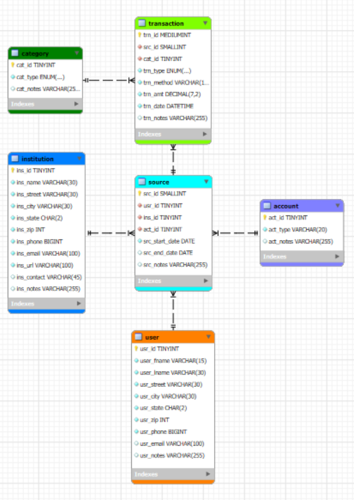

# Financial Transaction Database Design

This project models a relational database for managing financial transactions.

The schema was designed using MySQL Workbench based on a set of business rules for tracking user accounts, financial institutions, transaction categories, and individual transactions.

## Entity Relationship Diagram

## Tables Included

- user
- account
- source
- institution
- category
- transaction

## Skills Demonstrated

- Relational database design
- Entity-relationship modeling
- Database normalization
- MySQL Workbench data modeling
- Financial transaction data modeling
